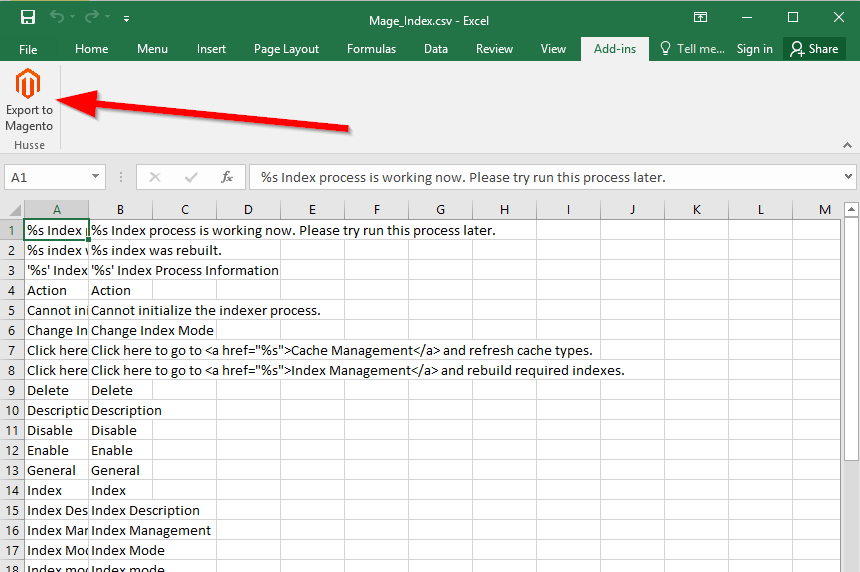
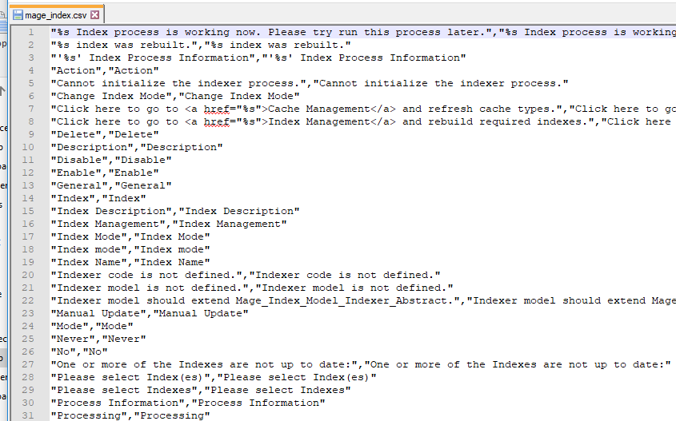

# MagentoCsvExcelAddin
Addin for Excel that allows to export excel files to magento translation dictionary .csv files

Download the setup file from:
https://github.com/ximocoder/MagentoCsvExcelAddin/blob/master/Setup/Setup.zip

Unzip it and run Setup.exe, it will install a new button in the ribbon bar of excel (you need at least excel 2013)

You need to have an excel with two columns, left one in English, right one is the translation. Then you click on Export to Magento and it will ask you where to save the csv file based on the excel.

You can check the csv files as usual with the notepad++ to check if the addin works as expected

